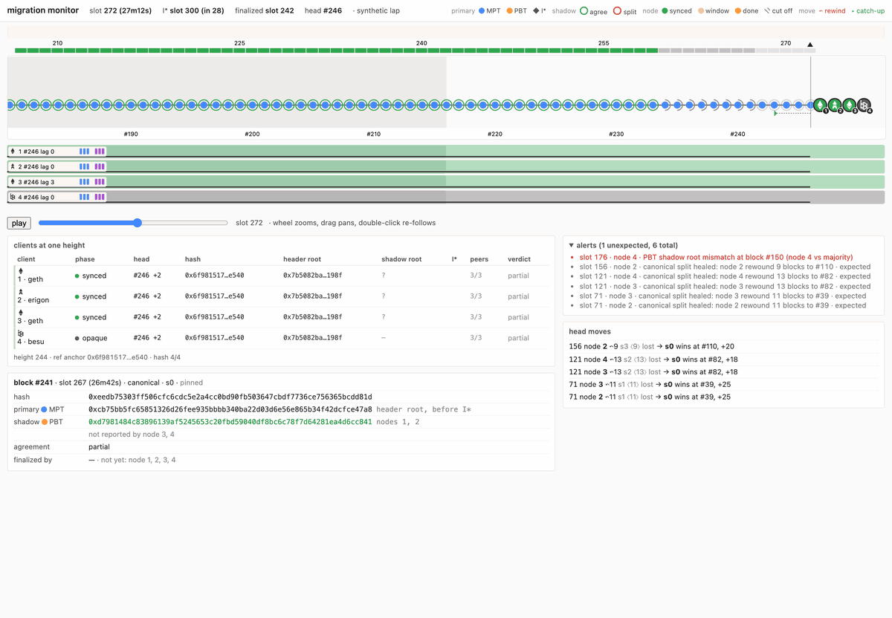

# pbt-devnet

A Kurtosis devnet for the **EIP-8297 partitioned binary tree** and **EIP-8347**, the live
migration onto it. Execution clients run one chain under real lighthouse consensus clients and
must agree on every state root while the network is partitioned and reorged on purpose. It
composes [ethpandaops/ethereum-package](https://github.com/ethpandaops/ethereum-package) with no
patches: the tree comes in through supported configuration and a genesis-generator fork.

| scenario | command | what it tests |
|---|---|---|
| **tree at genesis** | `make tree-at-genesis` | EIP-8297: two geth, two besu and two erigon, each pair configured differently, start on the binary tree and stay in agreement through forced reorgs and state scenarios |
| **live migration** | `make migration`, `make migration-smoke` | EIP-8347: four geth start on the merkle trie, build the tree in the background and switch at `binaryTrieTime`, with partitions before, across and after the switch |

Args files: `args/tree-at-genesis.yaml`, `args/migration.yaml`, `args/migration-smoke.yaml`.
`make help` lists every target, grouped.

## What you need

Docker, [Kurtosis](https://docs.kurtosis.com/install) 1.20+ (1.15 cannot interpret
ethereum-package), Python 3, Go, and a JDK 25 for the besu build (`brew install openjdk@25`,
keg-only). `make build` clones the client forks beside this repo and builds the images the
chosen args file needs: besu (two Gradle stages) and erigon only when a participant runs them.

## Tree at genesis

```bash
make tree-at-genesis   # build, start args/tree-at-genesis.yaml, follow the root monitor
make down
```

`pbtmonitor` follows every client's head and state root (`chain number=... state_root=... clients=N`)
and prints `reorg observed ...` when one moves. Reorgs are on by default: `pbtchaos` cuts the next
proposer's p2p around its slot every 15-30 blocks and runs state scenarios (`code-sole`,
`code-shared`, `delegate`, `account`, `storage-add`, `storage-del`) that strand state on a doomed
branch and check it is gone from every client after the heal. `make scenario NAME=... DEPTH=...`
runs one by hand; `pbt_chaos: {enabled: false}` in the args gives a quiet baseline. Participant 1
is the bootnode and is never partitioned; the per-node flags that make each pair differ are in
`args/tree-at-genesis.yaml`.

Lighthouse bans a peer it could not reach during a partition and the ban outlives the heal, so
every cut leaves holes in the consensus mesh; `make repeer` restarts the clients holding bans and
waits until every one sees the whole mesh again. The migration lap does this before each scenario;
here it is on you, and `pbtchaos` refuses a scenario whose majority is already one cut from an
island rather than measure a forked majority.

## Live migration

```bash
make migration                            # full lap, ~1 h, judged at the end
make migration-smoke                      # ~45 min
make up ARGS=args/migration.yaml          # the network alone: no restart, scenarios or verdict
```

The chain starts on the merkle trie with `binaryTrieTime` 1800 s (smoke: 780 s) after genesis.
**I\*** is the first block whose timestamp is `>= binaryTrieTime`: headers before it carry the
merkle root, from it on the binary root. Each geth builds the binary tree in the background from
block-level access lists and, after I\*, keeps the merkle side as a shadow until the first
post-fork block finalizes.

The bootnode (participant 1) anchors 40% of the stake and is never partitioned, so every heal
converges on its chain; the three lights hold 20% each. What a lap does:

| phase | migration | migration-smoke |
|---|---|---|
| before I\* | two deep partitions on a pair of lights (40%: finality stalls, the pair still loses, depth >= 10), a short one on a light, node 4 restarted in the gap | one short |
| across I\* | every light on its own island from I\*-120 s, healed at I\*+60 s once each has crossed on its own block (at I\*+180 s regardless): each light rewinds below I\* and re-crosses on the anchor's block | same |
| after I\* | a partition inside the open migration window; once every client reports done, a deep pair, then the six state scenarios on the finished tree | a short, then the scenarios |

`scripts/lap.sh` drives it (`ENCLAVE`, `ARGS`, `OUT=/tmp/<enclave>-lap`, `RESTART_NODE=0` skips
the restart) and ends with the judge: one `PASS`/`FAIL`/`INCONCLUSIVE` line per check (fork block
per node, per-victim straddle rewind, heals within their deadlines, orphaned fork blocks gone
everywhere, shadow-root agreement, completion after the fork block finalized, the lap manifest),
exit code = number of failures. Logs, JSONL, manifest and `summary.md` land in `OUT`.

## Watching it

```bash
make ui           # every URL: the migration monitor, dora, spamoor, disruptoor, pbtchaos
make ui-preview   # the monitor page on a synthetic lap, no enclave needed
```



The migration monitor draws the chain on a slot axis: canonical chain on lane 0, every competing
branch on its own lane, blocks coloured by their primary root (merkle blue before I\*, binary
orange after) and ringed by cross-node agreement on the shadow root. Node chips ride their heads;
a reorg leaves a rewind arrow to the common ancestor, a catch-up arrow along the winner and a ghost
of the node at the tip it left. Partitions and the schedule sit on the same axis. Hover a block for
its roots, click to pin it in the inspector. Dora is the consensus-side view (finality, proposers);
`make status`, `make compare`, `make forks` and `make diagnose` answer the same questions from the
terminal.

## Adding another execution client

The migration profiles are geth-only; `main.star` refuses any other client at plan time
(`MIGRATION_READY_CLIENTS`). A client needs:

1. **A scheduled fork**: start on the merkle trie, read `binaryTrieTime` from genesis.json, switch
   the header root at I\* as defined above, and execute I\* against a binary view of the parent's
   state.
2. **An introspection adapter** (`migmon.Client`): migration progress per direction and the shadow
   root per block.
3. **A registry entry** (`internal/migmon/registry.go`) with its evidence contract, and a reorg
   log pattern to corroborate heals.
4. **An args participant block**, and its image in `scripts/build-images.sh`.

With step 1 done and the client added to `MIGRATION_READY_CLIENTS`, the client-agnostic checks
(`chain-before-fork`, `boundary-agreement`, `forkblock-convergence`) already tell whether it
switches on the same block as geth. Erigon rejects a future `binaryTrieTime` and runs only at
genesis.
