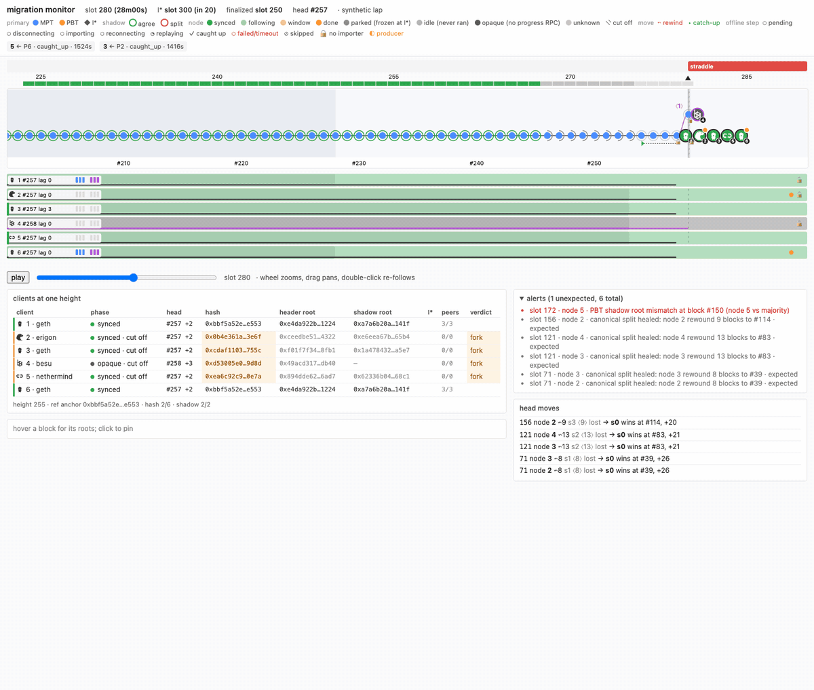

# pbt-devnet

A Kurtosis devnet for the **EIP-8297 partitioned binary tree** and **EIP-8347**, the live
migration onto it. Execution clients run one chain under real lighthouse consensus clients and
must agree on every state root while the network is partitioned and reorged on purpose. It
composes [ethpandaops/ethereum-package](https://github.com/ethpandaops/ethereum-package) with no
patches: the tree comes in through supported configuration and a genesis-generator fork.

| scenario | command | what it tests |
|---|---|---|
| **tree at genesis** | `make tree-at-genesis` | EIP-8297: two geth, two besu, two erigon and one Nethermind, with each pair configured differently, start on the binary tree and stay in agreement through forced reorgs and state scenarios |
| **live migration** | `make migration`, `make migration-smoke` | EIP-8347: two geth, erigon, besu and Nethermind start on the merkle trie, build the tree in the background and switch at `binaryTrieTime`, with partitions before, across and after the switch |
| **offline migration** | `make migration-offline` | EIP-8347's offline path on the same live network: geth and erigon export a real PBT snapshot and preimage file at their head, then, once that block has finalized, Nethermind and geth import the other client's artifacts one at a time, replay block access lists to the head and switch with everyone else |

Args files: `args/tree-at-genesis.yaml`, `args/migration.yaml`, `args/migration-smoke.yaml`,
`args/migration-offline.yaml`.
`make help` lists every target, grouped.

## What you need

Docker, [Kurtosis](https://docs.kurtosis.com/install) 1.20+ (1.15 cannot interpret
ethereum-package), Python 3, Go, and a JDK 25 for the besu build (`brew install openjdk@25`,
keg-only). `make build` fetches each client fork at its pinned commit into `../pbt-devnet-src/`
(`scripts/sources.sh` holds the pins: a `PBT_*_REF` moves one, a `PBT_*_SRC` builds your own
checkout instead) and builds the images the chosen args file needs: besu (two Gradle stages) and
erigon only when a participant runs them.

## Tree at genesis

```bash
make tree-at-genesis   # build, start args/tree-at-genesis.yaml, follow the root monitor
make down
```

`pbtmonitor` follows every client's head and state root (`chain number=... state_root=... clients=N`)
and prints `reorg observed ...` when one moves. Reorgs are on by default: `pbtchaos` cuts the next
proposer's p2p around its slot every 15-30 blocks and runs state scenarios (`code-sole`,
`code-shared`, `delegate`, `account`, `storage-add`, `storage-del`) that strand state on a doomed
branch and check it is gone from every client after the heal. `make scenario NAME=... DEPTH=...`
runs one by hand; `pbt_chaos: {enabled: false}` in the args gives a quiet baseline. Participant 1
is the bootnode and is never partitioned; the per-node flags that make each pair differ are in
`args/tree-at-genesis.yaml`.

Lighthouse bans a peer it could not reach during a partition and the ban outlives the heal, so
every cut leaves holes in the consensus mesh; `make repeer` restarts the clients holding bans and
waits until every one sees the whole mesh again. The migration lap does this before each scenario;
here it is on you, and `pbtchaos` refuses a scenario whose majority is already one cut from an
island rather than measure a forked majority.

Nethermind builds as `nethermind-pbt:local` from
[`NethermindEth/nethermind`](https://github.com/NethermindEth/nethermind/tree/pbt-state) at a
pinned `pbt-state` commit (`PBT_NETHERMIND_REF` moves it), or from
a local checkout named by `PBT_NETHERMIND_SRC`. `--Pbt.Enabled=true` switches its PBT backend on in
every profile; the chainspec decides the mode - binary tree from genesis here, a flat-to-PBT
migration when `binaryTrieTime` is after genesis. `--Sync.FastSync=false` selects full sync.

## Live migration

```bash
make migration                            # full lap, ~1 h, judged at the end
make migration-smoke                      # ~45 min
make up ARGS=args/migration.yaml          # the network alone: no restart, scenarios or verdict
```

The chain starts on the merkle trie with `binaryTrieTime` 1800 s (smoke: 780 s) after genesis.
**I\*** is the first block whose timestamp is `>= binaryTrieTime`: headers before it carry the
merkle root, from it on the binary root. Each client builds the binary tree in the background -
geth from block-level access lists, erigon by folding both commitment domains from `erigon init`
(`COMMITMENT_HEX_BIN=true`), Nethermind by mirroring its flat state into the PBT backend
(`--Pbt.Enabled`, the chainspec's `binaryTrieTime` selecting the migration, anchor bootstrapped
from the genesis allocation), besu by swapping the trie per header. After I\* geth, Nethermind and
erigon keep their merkle tree so a reorg can still cross back over the fork: geth frozen at I\* until the fork block
finalizes, Nethermind as a following shadow until then, erigon until 96 blocks past the fork
(`MAX_REORG_DEPTH`). Participants 1 and 3 run geth, 2 erigon, 4 besu, 5 Nethermind.

The bootnode (participant 1) anchors 29% of the stake and is never partitioned, so every heal
converges on its chain; the four lights hold 18% each. What a lap does:

| phase | migration | migration-smoke |
|---|---|---|
| before I\* | two deep partitions on a pair of lights (35%: finality stalls, the pair still loses, depth >= 10), a short one on a light, node 4 restarted in the gap | one short |
| across I\* | every light on its own island from I\*-120 s, healed at I\*+60 s once each has crossed on its own block (at I\*+180 s regardless): each light rewinds below I\* and re-crosses on the anchor's block | same |
| after I\* | a partition inside the open migration window; once every client reports done, a deep pair, then the six state scenarios on the finished tree | a short, then the scenarios |

`scripts/lap.sh` drives it (`ENCLAVE`, `ARGS`, `OUT=/tmp/<enclave>-lap`, `RESTART_NODE=0` skips
the restart) and ends with the judge: one `PASS`/`FAIL`/`INCONCLUSIVE` line per check (fork block
per node, per-victim straddle rewind, heals within their deadlines, orphaned fork blocks gone
everywhere, shadow-root agreement, completion after the fork block finalized, the lap manifest),
exit code = number of failures. Logs, JSONL, manifest and `summary.md` land in `OUT`.

## Offline migration

```bash
make migration-offline                                    # ~1.5 h, judged at the end
OFFLINE_FAULT=corrupt-preimages make migration-offline    # negative lap: geth's import must fail
```

`args/migration-offline.yaml` is `migration.yaml` (same network, load and chaos) with
`binaryTrieTime` 3000 s after genesis and a sixth participant, a geth with no validators. No
schedule names it, and every partition keeps it on the anchor's side: left out of the groups it
would stay peered with every island and join them back together. After
the last pre-fork heal (+940 s, +120 s to converge) `cmd/migration-swap`, started by `lap.sh`:

1. **exports** - participant 6 stops briefly (no stake lost) and `geth bintrie convert` runs on a
   copy of its datadir; erigon (2) runs `snapshots export-pbt` live. Each artifact is anchored at
   its producer's head, and its `pbtRoot` is checked against every client's shadow root there;
2. **swaps**, one at a time, each only once its anchor is finalized and canonical, finality is
   fresh, every other validator is up, no partition is applied and the chaos schedule leaves a gap
   long enough: Nethermind (5) stops, gets participant 6's artifacts and restarts importing them
   (`--Pbt.MigrationSnapshotPath`, its genesis-seeded PBT database wiped); then geth (3) does the
   same with erigon's (`geth bintrie import --force`). Each replays block access lists from its
   anchor to the head before the next one starts; after a failed swap, the next waits only for
   that node's EL to be back at the head.

One light down at a time is 18% of the stake, so finality never stops for a swap. The
wrappers that run the import live in `images/geth` and `images/nethermind`, layered over the
client images; without their marker files they are the plain entrypoint. Besu and erigon have no
importer for another client's artifacts and stay on the online path; participant 1 is never
taken down. Evidence lands in `OUT/artifacts/` and `OUT/swaps.json`. The judge adds
`artifact-produced`, `import-accepted`, `swaps-serialized`, `replay-caught-up` and
`offline-coverage` (inconclusive on the other profiles), and waives a swapping node's
findings for its own downtime the way it waives a partition victim's.

## Watching it

```bash
make ui           # every URL: the migration monitor, dora, spamoor, disruptoor, pbtchaos
make ui-preview   # the monitor page on a synthetic lap, no enclave needed
```



The migration monitor draws the chain on a slot axis: canonical chain on lane 0, every competing
branch on its own lane, blocks coloured by their primary root (merkle blue before I\*, binary
orange after) and ringed by cross-node agreement on the shadow root. Node chips ride their heads,
each carrying its client's mark and its participant number. On the offline lap each chip also
shows its step: pending, disconnecting, importing, reconnecting, BAL replay with its progress
from the anchor, caught up; a lock where a client has no importer, a corner badge on a producer,
a dashed marker at each anchor and the swap queue beside the legend;
a reorg leaves a rewind arrow to the common ancestor, a catch-up arrow along the winner and a ghost
of the node at the tip it left. Partitions and the schedule sit on the same axis. Hover a block for
its roots, click to pin it in the inspector. Below the chain, the client table puts every
participant side by side **at one height** - its hash there, its header root, its shadow root, the
block it crossed I\* on - because comparing each client at its own head reports a one-block lead as
a disagreement. Agreement is never coloured; a cell turns red only for a disagreement nobody asked
for, and amber while the node is partitioned or still settling after a heal. Dora is the
consensus-side view (finality, proposers); `make status`, `make compare`, `make forks` and
`make diagnose` answer the same questions from the terminal.

## Adding another execution client

The migration profiles run geth, erigon, besu and Nethermind; `main.star` refuses any other client at plan time
(`MIGRATION_READY_CLIENTS`). A client needs:

1. **A scheduled fork**: start on the merkle trie, read `binaryTrieTime` from genesis.json, switch
   the header root at I\* as defined above, and execute I\* against a binary view of the parent's
   state.
2. **An introspection adapter** (`migmon.Client`): migration progress per direction and the shadow
   root per block.
3. **A registry entry** (`internal/migmon/registry.go`) with its evidence contract: the reorg log
   pattern that corroborates heals, whether orphaned blocks stay readable by hash, and whether the
   client retires the other tree once the fork block finalizes. Checks scope themselves to what a
   client declares, so a missing entry weakens the verdict rather than inventing a failure: geth
   retires its shadow, erigon keeps folding both commitment domains, and both are judged on their
   own contract.
4. **An args participant block**, and its image in `scripts/build-images.sh`.

With step 1 done and the client added to `MIGRATION_READY_CLIENTS`, the client-agnostic checks
(`chain-before-fork`, `boundary-agreement`, `forkblock-convergence`) already tell whether it
switches on the same block as the others.
